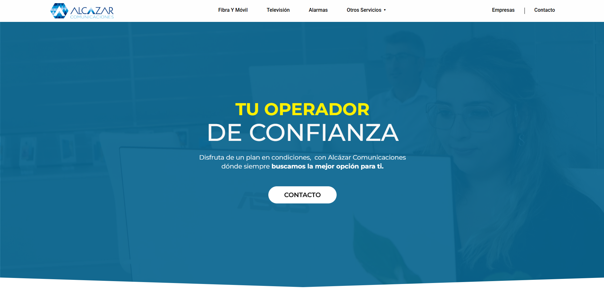

# 🌐 Proyecto: Alcázar Comunicaciones

## 🧩 Descripción
Sitio web corporativo desarrollado para **Alcázar Comunicaciones**, diseñado y programado desde cero con **WordPress** y componentes personalizados en **HTML, CSS y JavaScript**.  
El objetivo principal fue crear una web moderna, funcional y optimizada, manteniendo una identidad visual clara y profesional.

---

## 🛠️ Tecnologías y herramientas utilizadas
- **WordPress** (estructura base y gestión de contenido)  
- **HTML5 / CSS3 / JavaScript** (componentes visuales y efectos personalizados)  
- **SEO Optimization**: mejora de metadatos, estructura de encabezados y rendimiento en buscadores  
- **Figma** para el diseño original y la maquetación previa  
- **Herramientas**: Visual Studio Code, FileZilla 

---

## 🚀 Tareas realizadas
- Diseño completo de la interfaz en **Figma**.  
- Implementación del diseño en **WordPress** mediante código y Elementor.  
- Creación de componentes dinámicos en **JavaScript**.  
- Optimización de **velocidad de carga y SEO**.  
- Mejora de la **usabilidad y estructura responsive**.  

---

## 🔗 Enlaces
- 🌍 **Web online:** [www.alcazarcomunicaciones.es](https://www.alcazarcomunicaciones.es/)  
- 🎨 **Diseño original en Figma:** [Ver prototipo](https://www.figma.com/design/90MKGxwI8Pdo1XEwzf9fMm/Pagina-Web-Alcazar?node-id=0-1&t=E3mrkZxDcDAxwUx2-1)  

*(La versión actual de la web puede haber sido modificada desde su diseño e implementación original.)*
